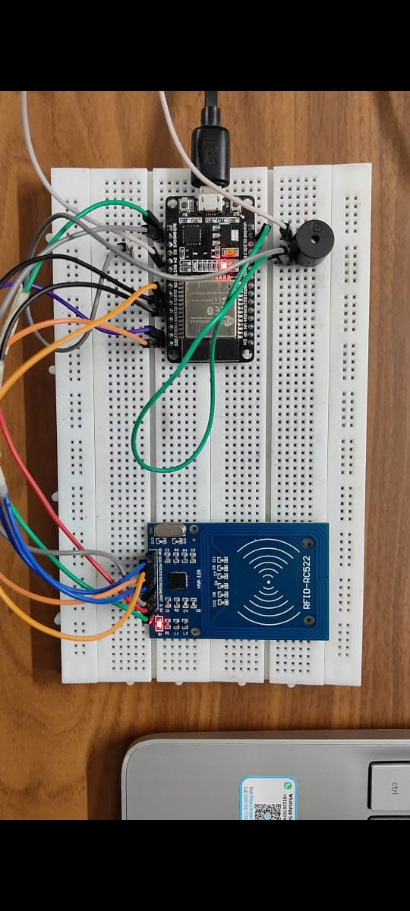
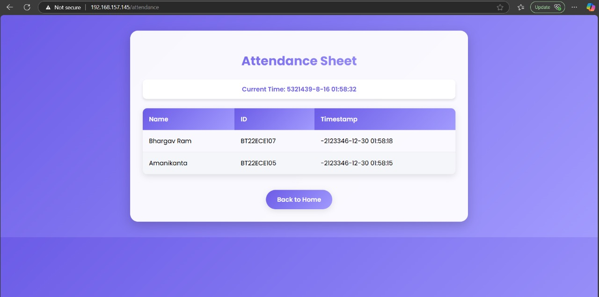

# 📌 IoT-Based RFID Attendance System  

This project implements an **IoT-based Attendance System** using **RFID technology**, where students/employees can mark their attendance by scanning RFID cards.  
The system records attendance data in real-time and uploads it to a cloud/IoT platform for monitoring and management.  

The design combines **hardware (RFID reader, microcontroller, Wi-Fi module)** and **software (IoT cloud, database, dashboard)** to provide a **secure, automated, and paperless attendance system**.  

---

## 📂 Repository Structure  
IOT-RFID-Attendance-System/
│── Hardware/ → Circuit diagrams & schematics (.pdf, .png)
│── Firmware/ → Microcontroller code (Arduino/ESP8266/ESP32)
│── Cloud/ → IoT integration scripts (MQTT/HTTP APIs)
│── Results/ → System snapshots & testing images
│── Docs/ → Project documentation (.pdf, .md)

yaml
Copy code

---

## 📷 Design Media  

### 🔹 System Block Diagram  
- RFID Reader → Detects card/tag UID  
- Microcontroller (ESP8266/ESP32/Arduino + Wi-Fi) → Processes data & sends to IoT server  
- IoT Cloud (Firebase/MQTT/ThingSpeak) → Stores attendance logs  
- Web/Mobile Dashboard → Displays attendance records  

  

---

### 🔹 Hardware Setup  

- **RFID Module (RC522/125kHz Reader)** connected to microcontroller  
- **ESP8266/ESP32** for IoT connectivity  
- **Buzzer/LED** for scan confirmation  
- **Breadboard setup** for prototype testing  

📌 *Actual implementation photo:*  

  

---

### 🔹 Dashboard View  
- Real-time attendance data accessible via IoT platform  
- Admins can view, add, or remove users  
- Secure cloud-based logging  

  

---

## ⚡ Working Principle  

1. Each student/employee is assigned a unique **RFID card/tag**.  
2. On scanning the card at the reader, the **microcontroller reads the UID**.  
3. UID is verified and attendance is **marked in the IoT database**.  
4. Data is updated in **real-time** and accessible on the web/mobile dashboard.  

---

## 🛠 Tools & Technologies Used  
- **Hardware**: RFID Reader (RC522/EM-18), ESP8266/ESP32, LCD/OLED, Buzzer  
- **Software**: Arduino IDE / Embedded C / MicroPython  
- **IoT Platform**: Firebase / MQTT / ThingSpeak / Blynk  
- **Database**: Cloud Firestore / Realtime Database  
- **Version Control**: GitHub  

---

📖 References
ESP8266 Documentation

Firebase IoT Integration

Arduino RFID RC522 Library

DUNNA MANIKANTA 
bt22ece104@iiitn.ac.in
